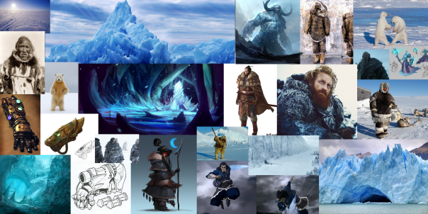
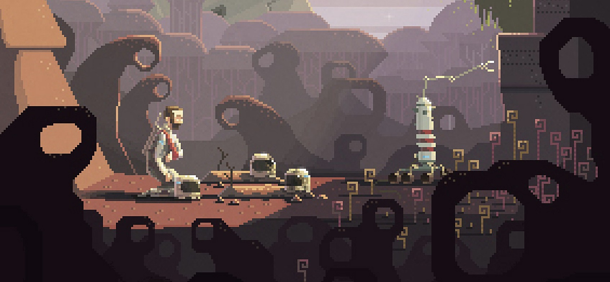
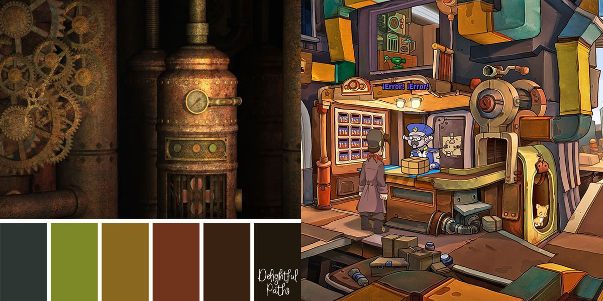
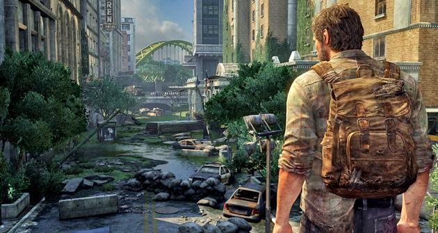
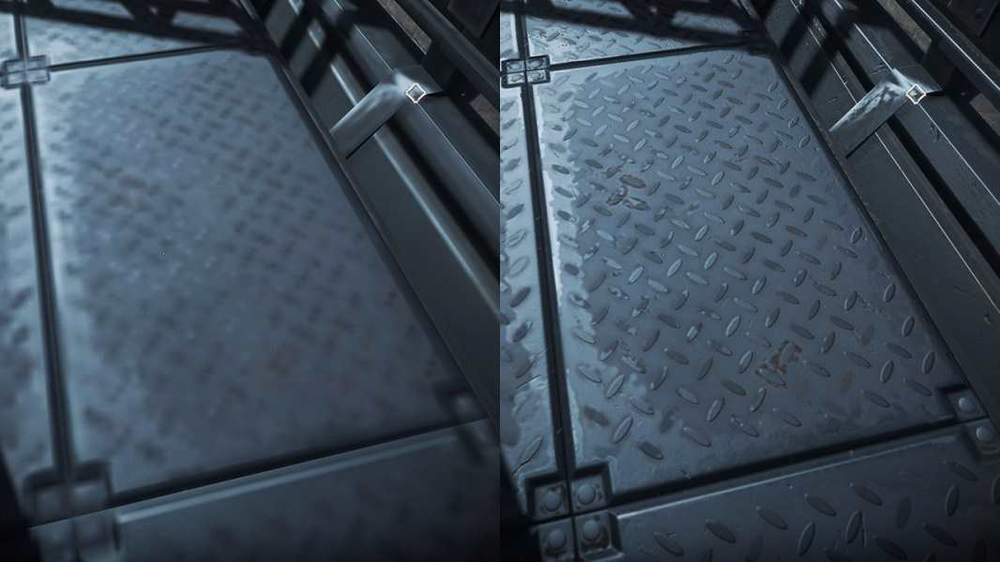
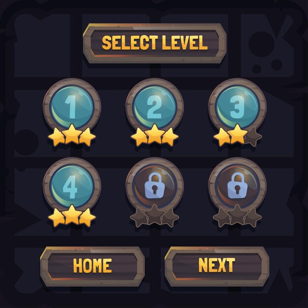
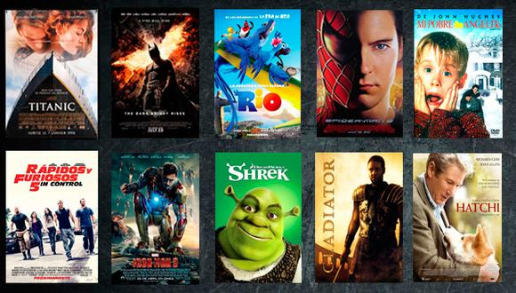

# Art Bible

## What is an Art Bible?

An Art Bible is a reference document or guide, which explains with details how has to be created the visual and artistic part of a videogame. The Art Bible helps the artistic team to communicate with each other and to avoid fatal errors.

## When is created?

This document or Guide for the artists is created after the GDD and before the art production of the videogame.

## What does an Art Bible?

The Art Bible functions are:

- How artists have to draw everything from de game.
- Manteins consistency throughout development.
- Helps the art team to understand what thwy have to do and what the art director says.
- Explains how the decisions related with the art style where made
- Helps with comunication and with the marketing

## Which questions can answere the Art Bible?

An Art Bible  has to answere some questions and has to be clear for everyone who want to read it. An Art Bible has to be as clear as posible, then if a new member join the art team could understand it. At the same time it has to answere the question: What is the target?. This Style Guide has to include the information about the art direction of the game that the sponsors and investors should know. Finally, has to have "How can I explain everyone which is the artistic intention of the videogame?" so the Art Bible has to explain everything and that everyone understand the same.

## Contents of the Art Bible

### - **Visual resources**:

      1. Concept art
      2. Photographs
      3. Diagrams
      4. Assets
      5. References and Moodboard
      
  

### - **Art Style**
   This part has to explain which **Environment Scale** has the game, which are the **Architectural Proportions** and the **Character Proportions**. **Who lives in the environment**, this means what type of environment the game has and how it is. In **which time the game happens** (day, night, past, future, etc). Also the **Weather**. **Common things or precious materials** of the world they are creating. **How artists should draw** all the things of the game. And, finally, **which tecnologies they should use**, as well as some tips, hints or advancements.

### - **Character Art**
   This part of the Art Bible has to include everything related with the **Character**, if there are various characters then this part has to include all of them, clear and organized so the drawings do not mix with each other. What this part has to include is:
      
      1. Expressions of the character
      2. Character poses
      3. Scale comparison with other elements of the scene
      4. Style and Creation
      5. Clothes and accessories
      6. Color Palette

### - L.O.D (Level of Details):
   This part of the Art Bible is really important, because defines the level of details the game has to have. It has to include the differences of details between the narrative, gameplay and the UI. Also how to increes or decrease the level of detail at the moment of drawing. What has to be detailed and what does not. Finally, related with the environment, the Art Bible has to include 

### - **Camera**:
   Inside this part of the Art Bible is necessary to add everything about the camera, because then is easier for the artists to know how to draw the perspective and where is the character respect to the background. The guide has to include the POV, the transitions, field of view, characters position, player position, effects and cutscenes.
   
### - **Color Palette**:
   This part is one of the most important because is what brings life to the game. The selection of colours can represent so many thing, just like the way the player has to follow, the importance of the things, wich character is the player, see the enemies, etc. Ther are so much things we have to consider in a Color Palette:
   
         1. Color Samples
         2. Hues
         3. Values and vitality
         4. Saturation

### - **Environment/atmosphere**:
   This one is related to the background, where is the character and ther are some thing to consider:
   
         1. The Scale of the environment
         2. Scheme
         3. Openness
         4. Weather conditions.

### - **Texture & Surface**:
   This one is related with the texture, in the case the game have different textures apart from the drawing, then is necessary to add which texture and how to use it.
   
   
   
### - **User interface**
   The artists have to crate the UI and make it related to the game but at the same time the player has to distinguish the UI from the rest of the game.
   Is necessary so the artists do not draw important things and then the UI cover them. Also is useful because artists have to draw the animations and where are the items.
   
         1. Animations
         2. Menu items and hud
         3. How to implement the UI design
         4. UX(user experience)
  
  
### - **Technical Guidelines**
   This section is related with the technical aspects of the work, because it has to explains how to export the drawings, naming conections, which tool artists should use, which limitations they have and resource collection and structuring of the work.
### - **References**
   Here is a list of what has to include this section:
   
         1. Photographs
         2. Ilustrations
         3. Ads
         4. Movies
         5. Games
         6. Comics

### Examples

[Art Bible example 1](https://www.artstation.com/artwork/nYmGZ9).
[Art Bible example 2](https://www.artstation.com/artwork/nAYke).
[Art Bible example 3](https://www.artstation.com/artwork/A8v2y).

### References

[Link 1](http://www.dota2.com/workshop/).
[Link 2](https://willytrek19.github.io/ArtBible/).
[Link 3](https://www.artstation.com/artwork/A8v2y).
[Link 4](https://www.artstation.com/artwork/nAYke).
[Link 5](https://www.artstation.com/artwork/nYmGZ9).
[Link 6](https://www.slideshare.net/kshiraj/game-art-bible-secret-sauce-to-making-great-game-art).

